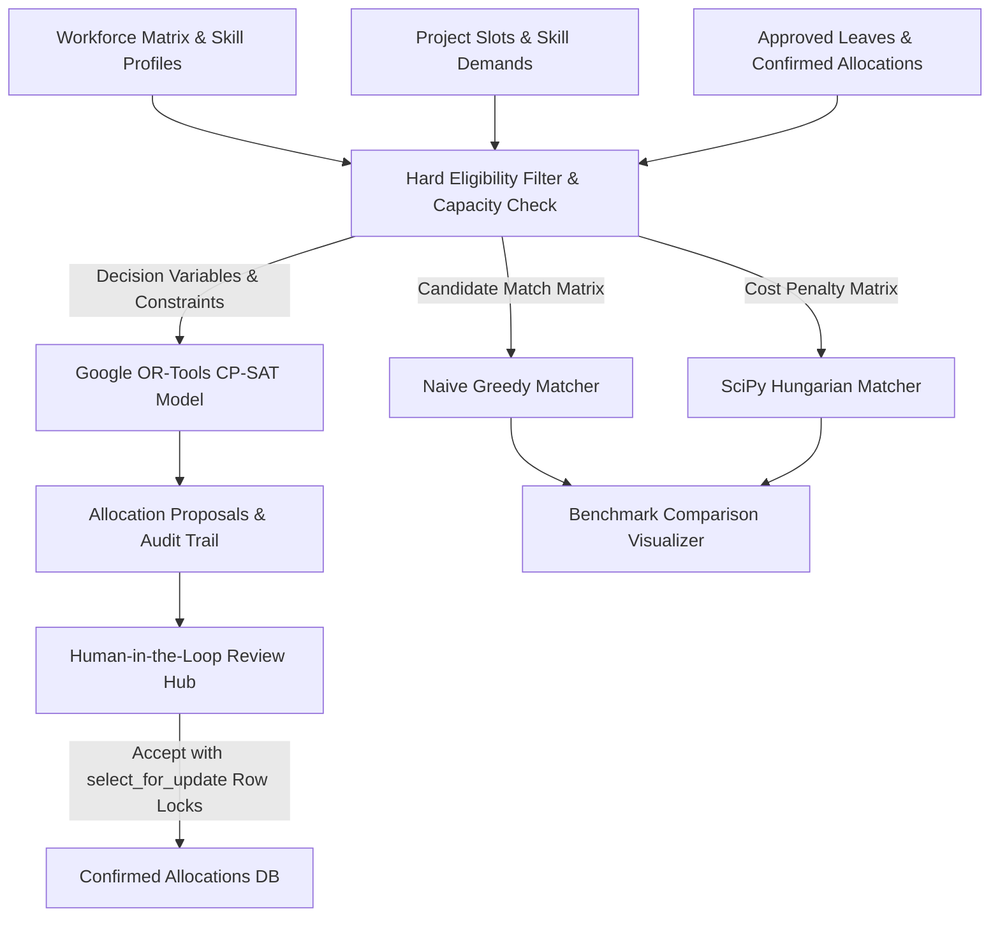

# BenchZero - Optimized Staffing Allocation Engine

> **Transforming workforce bench management from manual lookup into a Constraint Satisfaction & Multi-Objective Optimization Problem.**


---

## 📌 1. Existing System vs. BenchZero: Problem Statement

### ❌ The Limitations of Traditional Bench Management Systems
Traditional commercial bench management tools (Float, Runn, Resource Guru, spreadsheets) treat resource allocation as a simple **manual lookup & static scheduling exercise**. They present several critical drawbacks:

1. **Suboptimal Local Decisions (The "First-Come" Trap)**: Naive greedy allocation assigns the first eligible developer to the first requested project slot. This traps downstream high-priority projects with under-skilled or unavailable resources.
2. **Binary Availability Assumptions**: Traditional systems view resource availability as a binary "free or busy" flag. They lack a weekly fractional capacity model (e.g. 20h/wk on Project A + 20h/wk on Project B).
3. **Lack of Multi-Constraint Trade-off Analysis**: Manual resource managers struggle to simultaneously balance skill proficiency levels (1-5), project priority weighting (1-5), developer leave schedules, slot headcount limits, and hourly billing rates.
4. **Race Conditions & API Bypasses**: In existing tools, direct database writes or simultaneous project manager approvals frequently bypass hard business constraints, causing over-booking or double-booking.

### ✅ What BenchZero Solves
**BenchZero** reframes workforce bench allocation as a **Global Constraint Satisfaction Problem (CSP)** and **Integer Programming Optimization Problem** powered by **Google OR-Tools (CP-SAT Solver)**.

Given $N$ developers (skills, proficiency levels 1-5, max weekly hours, leave schedules, hourly costs) and $M$ open project slots (required skills, start/end dates, priority weight 1-5, headcount needed, weekly hours required), BenchZero computes the globally optimal assignment plan while strictly enforcing hard real-world constraints.

---

## 📊 2. Optimization Performance: How CP-SAT Beats Greedy

The three solver engines (CP-SAT, SciPy Hungarian, Greedy) are compared on every optimization run. Below is a **representative** comparison from a single run against the default seed dataset. Exact scores, bench counts, and gain percentages **vary between runs** depending on existing database state (prior allocations, proposals, and developer/project counts at execution time):

| Algorithm Engine | Mathematical / Logical Model | Example Quality Score | Example Bench Count | Example High-Prio Coverage | Example Gain |
| :--- | :--- | :--- | :--- | :--- | :--- |
| **Google OR-Tools CP-SAT** | **Constraint Programming / Integer Linear Programming** | ~1200–1600 | 4–6 Devs | 83–100% | **+5–12% Winner** |
| **SciPy Hungarian Matcher** | Linear Sum Assignment (`scipy.optimize.linear_sum_assignment`) | ~1200–1600 | 4–6 Devs | 83–100% | +5–12% |
| **Naive Greedy Matcher** | Local First-Best Decision (Highest Match First) | ~1100–1500 | 5–8 Devs | 66–83% | Baseline |

> **Why these are ranges, not fixed figures**: The comparison aggregates all pending proposals in the database, not just slots added in a single session. Running the same solver twice against different database states produces different absolute numbers. The *relative advantage* of CP-SAT over Greedy (consistently +5–12%) is the stable result.

*Why Greedy Fails*: A naive greedy loop assigns the highest match to the first slot it evaluates, getting trapped in suboptimal local decisions that lock out developers from higher-value downstream project slots. CP-SAT explores the full combinatorial decision space and guarantees global optimality.

---

## 🏗️ 3. Tech Stack & Architecture

- **Backend Framework**: Python 3.13, Django 5.x (requires `>=5.0,<6.0`), Django REST Framework (DRF)
- **Optimization Engines**:
  - **Google OR-Tools CP-SAT Solver** (`ortools.sat.python.cp_model`)
  - **SciPy Bipartite Matcher** (`scipy.optimize.linear_sum_assignment`)
  - **Naive Greedy Matcher** (Baseline Comparison)
- **Frontend Interface**: Glassmorphic Dark Single-Page Dashboard (HTML5, Vanilla CSS3, JavaScript ES6, Chart.js)
- **Database**: SQLite (Local Dev Default) & PostgreSQL (Production Docker Profile)
- **API Security**: DRF global rate limiting (`AnonRateThrottle`: 60 req/min, `UserRateThrottle`: 200 req/min), conditional write-auth gating via `REQUIRE_AUTH_FOR_WRITES`
- **Test Framework**: `pytest`, `pytest-django` (56 passing automated tests across 4 test modules)

### System Data Pipeline & Architecture



---

## ⚙️ 4. How BenchZero Works

### 1. Multi-Objective Score Formulation
For any eligible candidate pair of Developer $d$ and Project Slot $s$, BenchZero computes a normalized suitability score $S(d, s)$:
- **Base Skill Match Score**: Derived from developer proficiency levels vs. slot mandatory/optional minimum requirements.
- **Priority Weight Multiplier**: Multiplies base score based on project slot priority (P1 to P5).
- **Dynamic Cost Factor**: Dynamically scales hourly cost factors ($0.5$ to $1.5$) relative to the developer pool's minimum and maximum rates:
  $$\text{CostFactor} = 0.5 + 1.0 \times \frac{\text{MaxCost} - \text{Cost}_d}{\text{MaxCost} - \text{MinCost}}$$
- **Objective Targets**: Supports multiple optimization goals:
  - `balanced`: Skill fit + priority weighting + bench minimization.
  - `maximize_fit`: Prioritizes top-tier skill matches.
  - `maximize_priority`: Directs top talent to Critical (P5) projects.
  - `minimize_bench`: Maximizes total staff utilization.
  - `minimize_cost`: Optimizes budget efficiency.

> **Note on Mandatory vs. Optional Skill Requirements**: Skill requirements configured with `is_mandatory=False` are non-restrictive during candidate eligibility filtering. They do not disqualify candidates; instead, they are weighted in the multi-objective fit score calculation to reward and prioritize candidates who possess those optional skills.


### 2. Decoupled Human-in-the-Loop Pipeline
Algorithmic proposals (`AllocationProposal`) are strictly decoupled from official database bookings (`Allocation`). When the optimization engine runs:
1. Pending proposals from previous runs are automatically marked as `expired`.
2. CP-SAT generates new proposal records (`status='proposed'`).
3. Project Managers review recommendations in the dashboard and accept, reject, or bulk-accept proposals.

---

## 🛠️ 5. Key Challenges Faced & Engineering Solutions

During development and edge-case auditing, several complex logic, concurrency, and constraint loopholes were identified and resolved:

### 1. Slot Headcount Enforcement at Accept & API Time
- **Challenge**: Multiple proposals could be accepted for a single slot, exceeding `headcount_needed`. Direct REST calls to `/api/allocations/` could also over-staff slots.
- **Solution**: Enforced slot headcount as a mandatory database-level validation in `Allocation.clean()`, inside `accept_proposal`, `bulk_accept`, and direct REST serializers.

### 2. Multi-Slot Weekly Hours Capacity Model
- **Challenge**: Overlap checking was previously binary (yes/no per slot date range). Developers with `max_weekly_hours = 40` could not take two concurrent 20h/wk slots, or conversely could be over-committed to two 40h/wk slots.
- **Solution**: Formulated weekly capacity in CP-SAT as a linear sum constraint across all overlapping schedule dates:
  $$\sum_{s \in S_{\text{overlap}}} \text{assign}(d, s) \times \text{Hours}_s \le \text{MaxHours}_d - \text{CommittedHours}_d$$
  Also enforced exact sub-interval weekly hour accumulation inside `Allocation.clean()`.

### 3. Developer Availability & Leave Approval Workflow
- **Challenge**: Developers on leave were treated as available. Furthermore, allowing anyone to self-approve leave records created a bypass vulnerability.
- **Solution**: Created the `DeveloperLeave` model with an unapproved default (`is_approved=False`). Leave records only block developer scheduling once explicitly approved via `POST /api/leaves/{id}/approve/` (restricted to staff). Added a calendar sync extension point (`staffing/integrations/calendar_sync.py`).

### 4. Stale Proposals Invalidation
- **Challenge**: Older proposals from previous solver runs remained pending, allowing outdated recommendations to be accepted later.
- **Solution**: Engine automatically updates all pending proposals from prior runs to `status='expired'` with notes `"Superseded by SolverRun #X"` upon completing a new optimization run.

### 5. Concurrent Bulk Accept Race Conditions
- **Challenge**: Simultaneous bulk-accept calls for proposals touching the same slot could cause race conditions where both passed headcount checks before committing.
- **Solution**: Applied pessimistic row locking (`select_for_update()`) to both `ProjectSlot` and `Developer` rows within `@transaction.atomic()` blocks during `accept_proposal` and `bulk_accept`.

### 6. Direct REST API Access Lockdown
- **Challenge**: `POST /api/allocations/` bypassed skill requirement, headcount, and leave checks.
- **Solution**: Integrated `full_clean()` into `Allocation.save()` and `perform_create()`, ensuring mandatory skill prerequisites, headcount limits, approved leaves, and weekly capacity are validated regardless of entry point.

### 7. CP-SAT Server-Side Time Limit Capping
- **Challenge**: Unbounded user-supplied `time_limit` values could tie up background worker threads (DoS vector).
- **Solution**: Clamped `time_limit_seconds` server-side between 0.5 seconds and 60.0 seconds maximum.

### 8. Dynamic Cost Objective Scaling
- **Challenge**: Hardcoded $75/hr baseline broke score scaling for very expensive ($150+/hr) or cheap (<$35/hr) resource pools.
- **Solution**: Implemented dynamic min-max normalization relative to the current active developer pool's rate distribution.

### 9. Audit Trail & Atomic Revert Endpoint
- **Challenge**: No mechanism to cancel active allocations, sync originating proposals, or track status history.
- **Solution**: Added `AllocationAuditLog` model and implemented `POST /api/allocations/{id}/cancel/` endpoint to atomically mark allocations as `cancelled`, sync proposal notes, and record audit log entries.

### 10. Zero-Config Demo Mode vs. Production Auth
- **Challenge**: `AllowAny` permission was convenient for single-user demos but unsafe for production.
- **Solution**: Created `REQUIRE_AUTH_FOR_WRITES` environment setting and `DemoAwarePermission` / `DemoAwareAdminPermission`. Demo mode stays open by default; setting `REQUIRE_AUTH_FOR_WRITES=True` enforces login on all write/approval actions while keeping dashboard reads public.

---

## 🚀 6. Quickstart Guide

### 1. Local Python Setup

```bash
# Clone repository
git clone https://github.com/Tirupathi-Jayadeep/BenchZero.git
cd BenchZero

# Create and activate virtual environment
python -m venv .venv
source .venv/bin/activate  # On Windows: .venv\Scripts\activate

# Install dependencies
pip install -r requirements.txt

# Copy environment variables template (REQUIRED — see Auth section below)
cp .env.example .env

# Execute database migrations
python manage.py migrate

# Seed sample workforce and run initial solver run
python manage.py seed_data

# Start local server
python manage.py runserver 8000
```

Access the dashboard at `http://127.0.0.1:8000/` and Django Admin at `http://127.0.0.1:8000/admin/`.

---

### 2. Run Automated Test Suite

```bash
pytest
```

**Test Coverage Output (56 Passing Tests)**:
- `tests/test_api.py` (17 tests): REST API endpoints, headcount limits, allocation cancellation, expired proposal handling, bulk accept, advisory locking, bench trend.
- `tests/test_permissions_and_leave.py` (14 tests): Auth toggle (`REQUIRE_AUTH_FOR_WRITES`), leave pending/approval/revocation workflow, staff permission checks.
- `tests/test_solver.py` (13 tests): CP-SAT optimization, weekly capacity model, leave availability, skill minimums, algorithm comparisons.
- `tests/test_upload.py` (12 tests): Bulk JSON/CSV developer and project file imports, validation errors, partial batch failure handling, file size and row count limits, re-upload idempotency.

---

### 3. Authentication & Seed Data

> **⚠️ Security Notice:** `manage.py seed_data` creates a Django superuser `admin` with password `adminpassword` if one does not already exist. This account has full administrative access. **Change or delete this account immediately** if deploying to any non-local environment. The seed command is intended for local development and demos only.

> **⚠️ Default Auth Behavior:** `settings.py` defaults `REQUIRE_AUTH_FOR_WRITES` to `False` when no `.env` file is present, meaning all endpoints are open without authentication. The `.env.example` template sets it to `True`. **You must copy `.env.example` to `.env`** (the `cp .env.example .env` step in Quickstart) to activate write-auth gating. Skipping that step leaves every mutating endpoint publicly accessible.

When `REQUIRE_AUTH_FOR_WRITES=True` (set in `.env`):
- `GET` requests remain open for public dashboard viewing.
- Mutating actions (creating/cancelling allocations, running solver optimization, bulk-accepting proposals, managing projects/slots, and approving leaves) are strictly gated to authenticated staff users (Project Managers / Admins).
- For local zero-config interactive testing without login, set `REQUIRE_AUTH_FOR_WRITES=False` in `.env`.

To create a custom admin account (recommended over using the seeded `admin`):
```bash
python manage.py createsuperuser
```


---

### 4. Docker Compose Deployment

#### Local Development Profile
```bash
docker-compose up --build
```
Runs BenchZero local development web server (`DEBUG=True`) alongside a PostgreSQL container.

#### Production Profile
```bash
export SECRET_KEY="your-production-secret-key"
export ALLOWED_HOSTS="yourdomain.com,api.yourdomain.com"
docker-compose -f docker-compose.prod.yml up --build -d
```
Runs production Gunicorn WSGI server (`DEBUG=False`, `REQUIRE_AUTH_FOR_WRITES=True`, WhiteNoise static asset serving, 90s worker timeout) with immutable container builds.

> **Production checklist**: When `DEBUG=False`, `settings.py` raises `ImproperlyConfigured` if `REQUIRE_AUTH_FOR_WRITES` is not `True`, `SECRET_KEY` still contains the insecure default, or `ALLOWED_HOSTS` is unset. These are hard startup guards, not runtime warnings.

---

### 5. Multi-Process Optimization & Future Scale Roadmap

1. **Multi-Process PostgreSQL Advisory Locking**:
   - `POST /api/solver-runs/run/` uses PostgreSQL session advisory locks (`pg_try_advisory_lock` / `pg_advisory_unlock`) when running on Postgres, ensuring single-in-flight solver execution across all Gunicorn/WSGI worker processes and nodes. Falls back to `threading.Lock()` on SQLite.
   - *PgBouncer Caveat*: If deploying behind PgBouncer, ensure PgBouncer is configured in session-pooling mode (or switch to `pg_advisory_xact_lock` scoped within a database transaction).

2. **Async Task Queue (Celery / RQ)**:
   - For high-volume production beyond synchronous HTTP limits, solver runs can be offloaded to background task queues with task-level deduplication.

3. **Bench Trend Daily Snapshot Table**:
   - The `bench_trend` endpoint is computed dynamically ($O(\text{days} \times \text{allocations})$). For large enterprises (10,000+ staff), a nightly materialized daily-snapshot table can store pre-calculated availability metrics.


## 📁 7. Project Directory Structure

```
BenchZero/
├── benchzero/              # Django Project Configuration
│   ├── settings.py         # App Settings, REST Framework Auth & Throttling Config
│   ├── urls.py             # Root URL Routing
│   └── wsgi.py             # WSGI Entry Point
├── staffing/               # Main Application
│   ├── models.py           # Developer, ProjectSlot, Allocation, Leave, AuditLog Models
│   ├── permissions.py      # DemoAwarePermission & DemoAwareAdminPermission
│   ├── serializers.py      # DRF Model Serializers
│   ├── views.py            # REST ViewSets & Custom Action Endpoints
│   ├── urls.py             # API Router Registration
│   ├── admin.py            # Django Admin Customizations
│   ├── integrations/       # Calendar Sync Extension Point (calendar_sync.py)
│   ├── solver/             # Optimization Engines
│   │   ├── cpsat_solver.py # Google OR-Tools CP-SAT Solver Implementation
│   │   ├── scipy_solver.py # SciPy Bipartite Linear Sum Matcher
│   │   ├── greedy_solver.py# Naive Greedy Baseline Matcher
│   │   ├── eligibility.py  # Hard Skill, Capacity & Leave Filters
│   │   ├── fit_score.py    # Multi-Objective Dynamic Fit Score Calculator
│   │   └── runner.py       # Optimization Engine Execution & Benchmark Manager
│   ├── management/         # Django Management Commands
│   │   └── commands/
│   │       └── seed_data.py# Demo database seeder (creates admin/adminpassword superuser)
│   ├── static/             # CSS & JS Dashboard Assets
│   └── templates/          # Single-Page Dashboard (index.html)
├── tests/                  # Automated Test Suite (56 pytest tests)
│   ├── test_api.py         # REST API endpoints & concurrency tests (17 tests)
│   ├── test_permissions_and_leave.py  # Auth toggle & leave workflow (14 tests)
│   ├── test_solver.py      # Optimization engine & constraint tests (13 tests)
│   └── test_upload.py      # Bulk file import & validation tests (12 tests)
├── scripts/                # Demo & utility scripts
├── docker-compose.yml      # Docker Multi-Container Configuration (Dev)
├── docker-compose.prod.yml # Docker Production Configuration
├── Dockerfile              # Container Build Instructions
├── manage.py               # Django Management Script
├── pytest.ini              # Pytest Test Runner Config
└── requirements.txt        # Python Dependencies
```

---

## 📜 License

MIT License. Designed for Advanced Agentic Coding Benchmarks.
