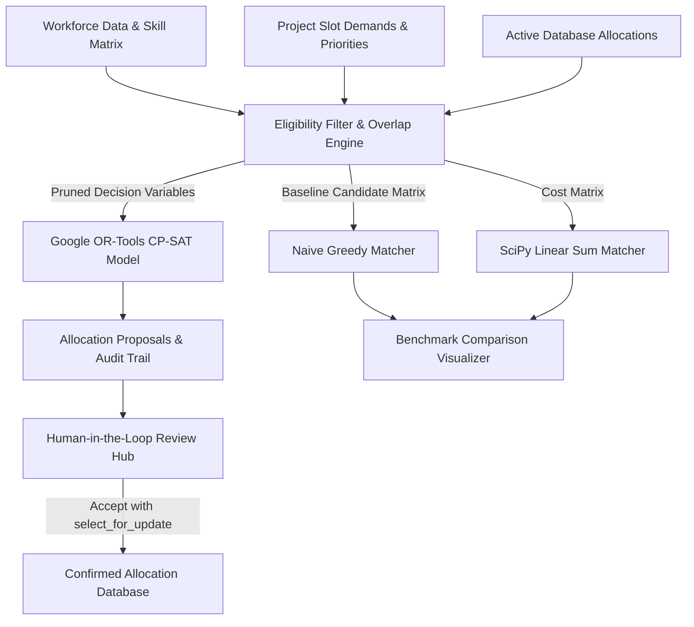

# BenchZero - Optimized Staffing Allocation Engine

> **Transforming workforce bench management from manual lookup into a Constraint Satisfaction & Multi-Objective Optimization Problem.**


---

## ⚡ Executive Pitch & Key Differentiator

Commercial bench management tools (Float, Runn, Kantata, Resource Guru) perform simple lookup & double-booking validation. **BenchZero** reframes staffing as a **global constraint-satisfaction optimization problem** powered by **Google OR-Tools (CP-SAT Solver)**.

Given $N$ developers (skills, proficiency levels 1-5, availability, hourly rates) and $M$ open project slots (required skills, start/end dates, priority weight 1-5, headcount), BenchZero computes the globally optimal assignment plan while satisfying strict hard constraints.

### 📊 Proven Optimization Performance
In benchmark comparisons against baseline algorithms on identical workforce datasets:

| Algorithm Engine | Math / Logic Model | Total Fit Score | Bench Count | High-Priority Coverage | Optimization Gain |
| :--- | :--- | :--- | :--- | :--- | :--- |
| **Google OR-Tools CP-SAT** | Integer Programming / Constraint Satisfaction | **805.0** | **8 Devs** | **100.0%** | **+11.4% Winner** |
| **Naive Greedy Matcher** | Local Decision (Highest Match First) | 722.5 | 9 Devs | 83.3% | Baseline |
| **SciPy Hungarian Matcher** | Linear Sum Assignment (1:1 Bipartite) | 800.0 | 8 Devs | 100.0% | +10.7% |

*Why Greedy Fails*: A naive greedy loop assigns the highest match to the first slot it evaluates, getting trapped in suboptimal local decisions that lock out developers from higher-value downstream project slots. CP-SAT explores the full decision space and proves global optimality.

---

## 🏗️ Core Architecture & Data Pipeline



### 🔒 Safety & Concurrency Architecture
1. **Existing Confirmed Allocation Exclusion**: Solvers check active confirmed `Allocation` records, excluding developers already committed during overlapping time windows.
2. **Transactional Concurrency Locks (`select_for_update`)**: Proposal acceptance endpoints use pessimistic row locking within `@transaction.atomic` blocks to prevent race conditions during simultaneous PM approvals (returning HTTP 409 Conflict if booked).
3. **Model-Level Safety Net (`clean()`)**: `Allocation.clean()` enforces zero overlapping confirmed allocations at save time.
4. **Human-in-the-Loop Approval**: Algorithmic proposals (`AllocationProposal`) are decoupled from official bookings (`Allocation`), allowing PMs to accept, reject, or bulk-approve suggestions.

---

## 🛠️ Tech Stack & Dependencies

- **Backend**: Python 3.13, Django 5.0, Django REST Framework
- **Optimization Engines**: Google OR-Tools CP-SAT Solver (`ortools.sat.python.cp_model`), SciPy (`scipy.optimize.linear_sum_assignment`), NumPy
- **Frontend Dashboard**: Glassmorphic Dark SPA (HTML5, Vanilla CSS3, JavaScript ES6, Chart.js)
- **Database**: SQLite (Local Dev Default) & PostgreSQL (Production / Docker Compose)
- **Testing**: `pytest`, `pytest-django`

---

## 🚀 Quickstart Guide

### 1. Local Python Setup

```bash
# Clone repository
git clone https://github.com/your-org/BenchZero.git
cd BenchZero

# Create and activate virtual environment
python -m venv .venv
source .venv/bin/activate  # On Windows: .venv\Scripts\activate

# Install dependencies
pip install -r requirements.txt

# Copy environment template
cp .env.example .env

# Run database migrations
python manage.py migrate

# Seed database with sample workforce & run initial optimization
python manage.py seed_data

# Start development server
python manage.py runserver 8000
```

Access the dashboard at `http://127.0.0.1:8000/` and Django Admin at `http://127.0.0.1:8000/admin/`.

---

### 2. Run Automated Tests

```bash
python -m pytest tests/
```

Test suite covers:
- Deterministic CP-SAT constraint safety (zero double-booking, skill enforcement).
- Existing confirmed database allocation exclusions.
- Concurrency locking & HTTP 409 Conflict responses.
- DRF API endpoint serialization and pagination.

---

### 3. Docker Compose (PostgreSQL Production Profile)

To run BenchZero with a PostgreSQL database container supporting native PostgreSQL exclusion constraints:

```bash
docker-compose up --build
```

---

## 📝 Known Demo Trade-offs & Design Choices

- **Authentication & Authorization**: `DEFAULT_PERMISSION_CLASSES` is set to `AllowAny` for single-user local demo convenience. For multi-tenant production, configure JWT (`djangorestframework-simplejwt`) or OAuth2.
- **Database Default**: Uses SQLite out-of-the-box for zero-dependency local runs. Production deployments can switch to PostgreSQL via `DATABASE_URL` or `docker-compose.yml`.

---

## 📜 License

MIT License. Designed for Advanced Agentic Coding Benchmarks.
